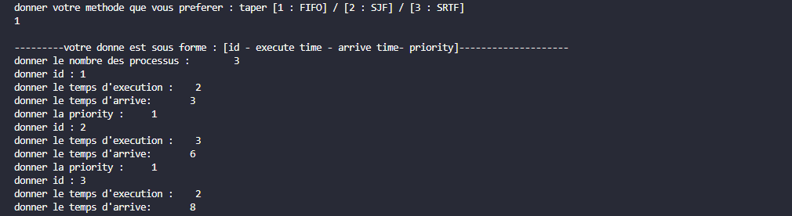

# Process Scheduling Simulation

This C program simulates three different process scheduling algorithms: First-Come, First-Served (FIFO), Shortest Job First (SJF), and Shortest Remaining Time First (SRTF).

## Overview

The program allows the user to choose a scheduling algorithm and input details for a set of processes, including their IDs, execution times, arrival times, and priorities. The simulation results are displayed, and an additional function (`affiche_SRTF`) provides a textual representation of the execution times.

## How to Use

1. Clone the repository to your local machine.

   ```bash
   git branch -M main
   git remote add origin https://github.com/Mededdahby/processor-simulation.git
   cd processor-simulation
   ```

2. Compile the C program.

   ```bash
   gcc main.c -o scheduler
   ```

3. Run the executable.

   ```bash
   ./scheduler
   ```

4. Follow the on-screen instructions to input the number of processes and details for each process.

5. Choose the scheduling algorithm:

   - Type `1` for FIFO.
   - Type `2` for SJF.
   - Type `3` for SRTF.

6. View the output, which shows the order in which processes are executed.

## Screenshots

| FIFO INPUT                 | FIFO Execution            |
| -------------------------- | ------------------------- |
|  |  |

| SRTF INPUT                 | SRTF Execution                          |
| -------------------------- | --------------------------------------- |
|  |  |
